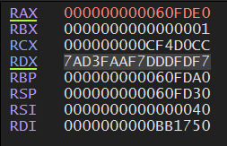
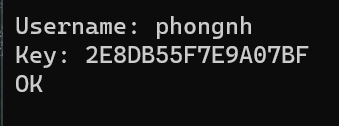

# Analysis

* Run this app and enter a random username, key. The app closed unexpectedly. So it seems like if we don't enter the right one, it will free the memory. Thus exit the app.

* Put this in <span style="color:red">*DIE*</span>, it appeared to be a PE64 app. So we will use <span style="color:red">*x64dbg*</span> for this one.

# Reverse

* Open this in <span style="color:red">*Ghidra*</span>, we can easily locate the main function.
undefined8 FUN_00402450(void)
```
{
  size_t sVar1;
  undefined8 uVar2;
  undefined in_stack_ffffffffffffffa8;
  undefined in_stack_ffffffffffffffb0;
  undefined in_stack_ffffffffffffffb8;
  uint local_38;
  undefined4 local_34;
  undefined4 local_30;
  undefined4 local_2c;
  uint local_24;
  char *local_20;
  uint *local_18;
  int local_c;
  
  FUN_004026f0();
  local_38 = 0x833d3433;
  local_34 = 0x9f389f;
  local_30 = 0x2398e64f;
  local_2c = 0x417acf39;
  local_18 = (uint *)malloc(0x100);
  local_20 = (char *)malloc(0x100);
  printf("Username: ");
  FUN_0040158f((char *)local_18);
  printf("Key: ");
  FUN_0040158f(local_20);
  sVar1 = strlen((char *)local_18);
  local_24 = (uint)sVar1;
  FUN_00401852((undefined8 *)&stack0xffffffffffffffb8,local_18,local_24,&local_38);
  for (local_c = 0; local_c < 8; local_c = local_c + 1) {
    FUN_00401540(&stack0xffffffffffffffa8 + local_c * 2,0x10,"%02X",
                 (ulonglong)(byte)(&stack0xffffffffffffffb8)[local_c],in_stack_ffffffffffffffa8,
                 in_stack_ffffffffffffffb0,in_stack_ffffffffffffffb8);
  }
  uVar2 = FUN_00401662((longlong)local_20,(longlong)&stack0xffffffffffffffa8);
  if ((int)uVar2 != 0) {
    puts("OK");
  }
  free(local_18);
  free(local_20);
  return 0;
}
```

* In <span style="color:red">*IDA*</span>, <span style="color:red">*sub_40158F*</span> (FUN_00401852 in <span style="color:red">*Ghidra*</span>), it seems to take the user's input and stored it at the addresses created by the <span style="color:red">*malloc*</span> function. In my case, <span style="color:red">*BB1880*</span> for the username and <span style="color:red">*BB19B0*</span> for the key.

* After that, there is a function call: <span style="color:red">*FUN_00401852*</span>. 
    - I put (a, a) and (a, 1) as username and key. And step through every lines of this function, notice the change in register's window. 

    - And in both cases, it produced the same value stored in <span style="color:red">*EDX*</span>
    (7AD3FAAF7DDDFD7F in my case)

      

    - We can safely assume that this function takes the username, performs some encrypting, and uses that encrypted value for <span style="color:red">*FUN_00401662*</span>, which leads us to the "OK" message (or not).

* Lets check on <span style="color:red">*FUN_00401662*</span>:
    - This function takes 2 parameters: <span style="color:red">*local_20*</span> and <span style="color:red">*stack0xffffffffffffffa8*</span>. 
    - <span style="color:red">*local_20*</span> is the address created for the key and <span style="color:red">*stack0xffffffffffffffa8*</span> is the address that stored the encrypted username.


    ```
    undefined8 FUN_00401662(longlong param_1,longlong param_2)

    {
    undefined8 uVar1;
    int local_c;
    
    local_c = 0;
    while( true ) {
        uVar1 = FUN_004015f8(*(char *)(param_1 + local_c));
        if ((int)uVar1 == 0) {
        return 0;
        }
        if (((*(char *)(param_1 + local_c) != *(char *)(param_2 + local_c)) &&
            ((int)*(char *)(param_1 + local_c) != *(char *)(param_2 + local_c) + 0x20)) &&
        (*(char *)(param_1 + local_c) + 0x20 != (int)*(char *)(param_2 + local_c))) break;
        local_c = local_c + 1;
        if ((*(char *)(param_1 + local_c) == '\0') || (*(char *)(param_2 + local_c) == '\0')) {
        return 1;
        }
    }
    return 0;
    }
    ```
    - Here, it checks each byte of the 2 parameter.
    - If 1 pair does not matched, 0 is returned in <span style="color:red">*EAX*</span>, which fail the <span style="color:red">*test eax, eax*</span> and exit our program.
    - Otherwise, <span style="color:red">*EAX*</span> is 1 and the "OK" message is put.

    ```
    uVar2 = FUN_00401662((longlong)local_20,(longlong)&stack0xffffffffffffffa8);
    if ((int)uVar2 != 0) {
        puts("OK");
    }
    free(local_18);
    free(local_20);
    return 0;
    ```

* With this in mind, we'll just have to put whatever the encrypted username is to the key (in order to jump to the "OK" message).
(Notice the ENDIANNESS) 

  

# Result:
```
username: phongnh
key: 2E8DB55F7E9A07BF
```

# Tools: 
* x64dbg
* Ghidra


