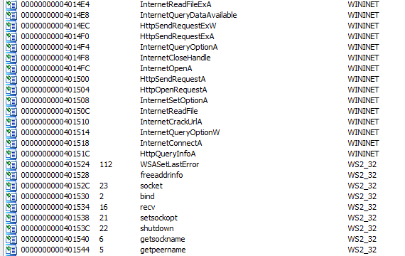
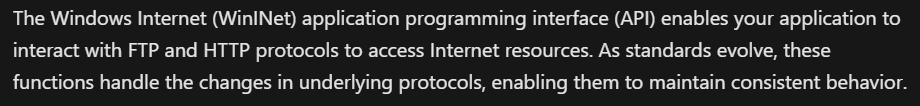
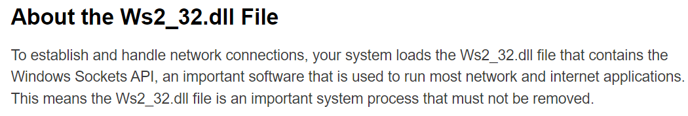
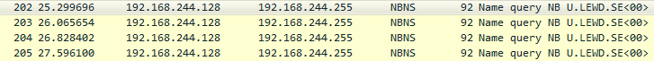
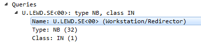
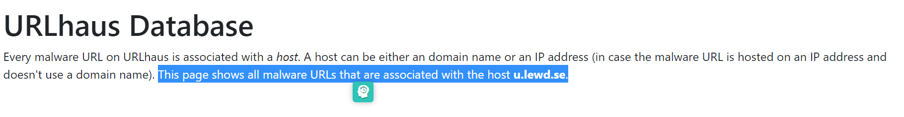
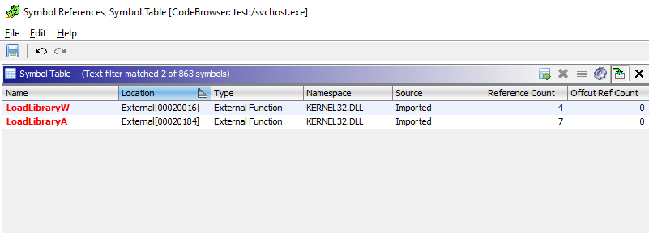

# Analysis

* First run the app, but it closed right away. It appears to be running in the background.

* In <span style="color:red">*IDA's Imports*</span>, we notice 2 libraries in used:

    

    - <span style="color:red">*WinINet*</span> enables your application to interact with FTP and HTTP protocols to access Internet resources 

    

    - <span style="color:red">*Ws2_32.dll*</span> establishes and handles network connections via Windows Socket API.

    

* With the use of these 2 libraries, I assume that this file is connecting to some server.


* Knowing this, we'll fire up <span style="color:red">*Wireshark*</span> and analyze the traffic.

    

* As you can see, there is a packet with the IP address of 192.168.244.128 and port 137 continuously sends request to 192.168.244.255.

* Moreover, NBNS is a server responsible for maintaining a list of mappings between NetBIOS computer names and network addresses for a network that uses NetBIOS as its naming service. When the computer needs to communicate with a remote machine, it queries the name server for the network address of the remote machine. I assume that the program takes something from the victim computer and sends to the server. (See https://pentestlab.blog/2018/05/08/nbns-spoofing/)

* Click on Info, we see that there are queries sent to U.LEWD.SE<00>

    

* Google <span style="color:red">*U.LEWD.SE*</span>, this is what I found:

    

* So <span style="color:red">*U.LEWD.SE*</span> is actually the domain name we are looking for!


# Reverse

* Since this app use HTTP, we will search for HTTP in WININET. We're end up with this:

```
int FUN_00406ece(undefined4 param_1,undefined4 param_2,undefined4 param_3,undefined4 param_4,
                uint param_5)

{
  ...
  iVar2 = HttpOpenRequestA(param_1,puVar5,param_2,"HTTP/1.1",0,&PTR_DAT_00422388,uVar1,0);
  ...
  iVar4 = HttpSendRequestA(iVar2,pcVar3,uVar6,param_3,param_4);
  ...
}
```

* So here it goes: It creates an HTTP request handle (<span style="color:red">*HttpOpenRequestA*</span>). If it succeed, it sends the specified request to the HTTP server (<span style="color:red">*HttpSendRequestA*</span>). Ok lets move on to the socket part.    

* To open a socket connection, it uses the <span style="color:red">*connect*</span> function in <span style="color:red">*ws2_32.dll*</span>;

```
SOCKET FUN_0040822e(void)
{
  SOCKET s;
  int iVar1;
  sockaddr *unaff_EDI;
  
  s = socket((uint)unaff_EDI->sa_family,1,6);
  if (s != 0xffffffff) {
    iVar1 = connect(s,unaff_EDI,((unaff_EDI->sa_family != 2) - 1 & 0xfffffff4) + 0x1c);
    if (iVar1 != 0) {
      closesocket(s);
      s = 0xffffffff;
    }
  }
  return s;
}
```

* Since there is only one function (<span style="color:red">*FUN_0040822e*</span>) call <span style="color:red">*connect*</span>, it is guaranteed to be used to connect to the target server.

# Program's Logic

* We know that the program is packed, so it will first unpacked itself using <span style="color:red">*LoadLibrary*</span>. Lets search for that.

    

* There are several calls to this function, but <span style="color:red">*FUN_00406b08*</span> contains something special:

    ```
    undefined FUN_00406b08(HANDLE param_1,LPWSTR param_2)
    {
        ...
        BVar3 = CreateProcessAsUserW
                            (param_1,(LPCWSTR)0x0,param_2,(LPSECURITY_ATTRIBUTES)0x0,
                            (LPSECURITY_ATTRIBUTES)0x0,0,
                            -(uint)(local_10 != (LPVOID)0x0) & 0x400 | 0x4000000,local_10, (LPCWSTR)0x0,
                            &local_6c,&local_28);
        ...
    }
    ```

    - <span style="color:red">*CreateProcessAsUserW*</span> is actually used to execute command. 

* Keep digging up, we will meet a series of call with the root to be <span style="color:red">*FUN_0041d16a*</span>.

```
uint FUN_0041d16a(undefined4 param_1,char param_2)
{
    ...
    FUN_0041cea2('\x01');
    ...
    FUN_00406c4b(DAT_00423a0c);
    ...
}
```

* <span style="color:red">*FUN_0041d16a*</span> calls <span style="color:red">*FUN_0041cea2*</span>, which indirectly calls <span style="color:red">*FUN_00406ece*</span> (the HTTP thing we mentioned before).

* In <span style="color:red">*FUN_0041cea2*</span>, there is a call to <span style="color:red">*FUN_00419baf*</span>. Which is then call <span style="color:red">*FUN_00419904*</span>, then <span style="color:red">*FUN_0041967b*</span>, finally <span style="color:red">*FUN_0040d35a*</span>.

    ```
    uint FUN_0040d35a(char param_1)

    {
        ...
        pvVar2 = CreateFileMappingW((HANDLE)0x0,(LPSECURITY_ATTRIBUTES)&DAT_004239e8,4,0,0x3d09128
                                        ,local_7c);
        ...
        pvVar2 = MapViewOfFile(pvVar2,2,0,0,0)
        ...
    }
    ```

    - This creates a file mapping object for that file, then it maps a view of a file mapping into somewhere in the file system.

* After that, there is a call to <span style="color:red">*FUN_00406c4b*</span>:

    ```
    uint FUN_00406c4b(LPCWSTR param_1)
    {
    ...
    uVar2 = FUN_00405f1d(":d\r\ndel \"%s\"\r\nif exist \"%s\" goto d",(char)local_108);
    uVar1 = (uint)uVar2;
    if ((0 < (int)uVar1) && (uVar1 = FUN_00406ca6(local_374), (char)uVar1 != '\0')) {
        return CONCAT31((int3)(uVar1 >> 8),1);
    }
    ...
    ```

    - Take a look at <span style="color:red">*uVar2*</span>. Seems like it deletes something to hide it's existence.

* <span style="color:red">*FUN_00406c4b*</span> is then call <span style="color:red">*FUN_00406ca6*</span>:

    ```
    uint FUN_00406ca6(LPCVOID param_1)
    {
    ...
    
    uVar1 = FUN_0040a569(&DAT_004031ec,local_250);
    if ((char)uVar1 != '\0') {
        CharToOemW(local_250,local_354);
        DVar2 = FUN_00405faa(&param_1,"@echo off\r\n%s\r\ndel /F \"%s\"\r\n");
        if (DVar2 != 0xffffffff) {
        uVar1 = FUN_0040a39d(local_250,param_1,DVar2);
        FUN_004051e6(param_1);
        if ((((char)uVar1 != '\0') &&
            (iVar3 = FUN_00405ed9(extraout_ECX,0x10e,L"/c \"%s\""), -1 < iVar3)) &&
            (DVar2 = GetEnvironmentVariableW(L"ComSpec",local_250,0x104), DVar2 - 1 < 0x103)) {
            FUN_00405299(local_48,0,0x44);
            local_18 = 0;
            local_1c = 1;
            DVar2 = FUN_00406aad(local_250,local_570,(LPCWSTR)0x0,local_48,(undefined *)0x0);
            return DVar2 & 0xffffff00 | (uint)(DVar2 != 0);
        }
        }
        uVar1 = FUN_0040a548(local_250);
    }
    return uVar1 & 0xffffff00;
    }
    ```

    - It actually creates a bat file that run in the background every time the computer start.

    - What's more, <span style="color:red">*FUN_00406ca6*</span> also calls <span style="color:red">*FUN_0040a548*</span>, which is used to delete itself.

    ```
    uint FUN_0040a548(LPCWSTR param_1)
    {
    uint uVar1;
    
    SetFileAttributesW(param_1,0x80);
    uVar1 = DeleteFileW(param_1);
    return uVar1 & 0xffffff00 | (uint)(uVar1 != 0);
    }
    ```

# Summary 
* The server's name: <span style="color:red">*U.LEWD.SE*</span>.
* The function to connect to server:
    ```
    SOCKET FUN_0040822e(void)
    {
    SOCKET s;
    int iVar1;
    sockaddr *unaff_EDI;
    
    s = socket((uint)unaff_EDI->sa_family,1,6);
    if (s != 0xffffffff) {
        iVar1 = connect(s,unaff_EDI,((unaff_EDI->sa_family != 2) - 1 & 0xfffffff4) + 0x1c);
        if (iVar1 != 0) {
        closesocket(s);
        s = 0xffffffff;
        }
    }
    return s;
    }
    ```
* The program's logic (up to the <span style="color:red">*connect*</span> part).

    - <span style="color:red">*entry*</span> calls <span style="color:red">*FUN_0041d16a*</span>.
    - <span style="color:red">*FUN_0041d16a*</span> is then calls <span style="color:red">*FUN_0041cea2*</span> for HTTP establishment.
    - <span style="color:red">*FUN_0041cea2*</span> calls <span style="color:red">*FUN_0040d35a*</span>, which is used for mapping. 
    - After that, there is a call to <span style="color:red">*FUN_00406c4b*</span>, which is then call <span style="color:red">*FUN_00406ca6*</span>.
    - Finally, <span style="color:red">*FUN_00406ca6*</span> creates a bat file that runs in the background then delete itself.

# Tools: 
* Wireshark
* IDA
* Ghidra

